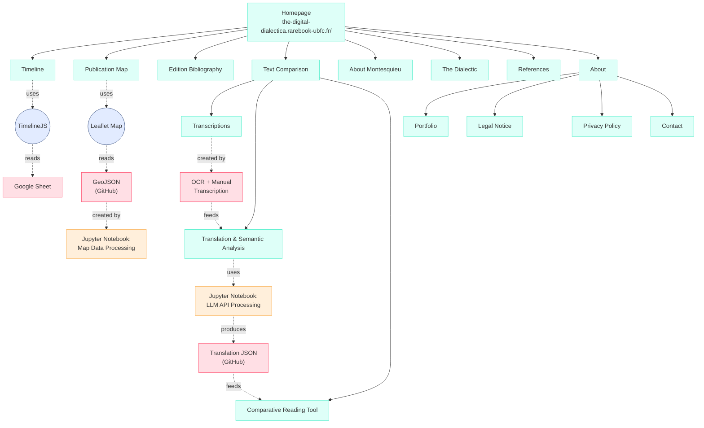

# The Digital Dialectica and Montesquieu's Book XIX

[](https://the-digital-dialectica.rarebook-ubfc.fr/)
[](LICENSE)

A critical Digital Humanities project examining Montesquieu's *De l'esprit des lois* Book XIX through computational methods that reveal productive tensions between contextual philosophy and digital abstraction.

**Author:** lokalkosmos  
**Institution:** Université de Franche-Comté (Marie et Louis Pasteur Université)
**Project Website:** https://the-digital-dialectica.rarebook-ubfc.fr/

---

## Table of Contents

- [Project Overview](#project-overview)
- [Research Philosophy](#research-philosophy)
- [Repository Structure](#repository-structure)
- [Corpus and Data](#corpus-and-data)
- [Methodological Approach](#methodological-approach)
- [Technologies Used](#technologies-used)
- [Architecture](#architecture)
- [What This Project Is (and Is Not)](#what-this-project-is-and-is-not)
- [Using This Repository](#using-this-repository)
- [Acknowledgments of Limitations](#acknowledgments-of-limitations)
- [Citation](#citation)
- [License](#license)
- [Acknowledgments](#acknowledgments)
- [Contact](#contact)

---

## Project Overview

This repository supports a Master's thesis examining Montesquieu's *De l'esprit des lois* Book XIX, specifically Chapters I-VI where he articulates the concept of *esprit général* (general spirit). The project employs Digital Humanities methods not as neutral instruments but as objects of critical analysis themselves, investigating what happens when computational approaches—which require abstraction and standardisation—encounter a text that philosophically resists such operations.

The central argument: **when digital tools meet Montesquieu's philosophy of irreducible contextual complexity, the resulting friction generates insights about both eighteenth-century political thought and contemporary digital scholarship.**

### Core Philosophical Position

> "The digital is not life."

Digital tools are **useful but limited instruments** that require critical humanistic interpretation. They are not ends in themselves, nor are they superior to traditional scholarship. This project treats computational limitations not as failures but as **philosophically significant findings** about the boundaries of algorithmic knowledge.

---

## Research Philosophy

This project adopts a **self-reflexive, critically aware** approach to Digital Humanities that distinguishes it from techno-utopian digital scholarship:

### What It Does

- ✅ **Treat digital tools as objects of critical analysis** alongside historical texts
- ✅ **Acknowledge limitations transparently** as epistemologically meaningful
- ✅ **Recognise that abstraction has consequences** for what becomes visible/invisible
- ✅ **Validate computational outputs** through sustained human interpretation
- ✅ **Embrace "productive friction"** when methods encounter resistant texts
- ✅ **Document methodological struggles** as research findings

### What It Rejects

- ❌ Claims that computational methods are objective or neutral
- ❌ Technological determinism or solutionism
- ❌ Reducing humanistic inquiry to pattern recognition
- ❌ "Black box" analysis without acknowledging opacity
- ❌ Treating scale as inherently superior to depth
- ❌ Digital methods as ideology rather than toolkit

Following scholars like Johanna Drucker, Alan Liu, and Stephen Ramsay, it is understand that **all data visualisation is rhetorical**, all tools encode political possibilities through their design, and digital humanities requires cultural criticism of its own practices.

---

## Repository Structure

```
Lesprit/
├── transcriptions/          # JSON files of 15 editions (1748-1797)
│   ├── 1748_geneva_fr.json
│   ├── 1750_london_en.json
│   └── ...
├── data/
│   ├── geojson/            # Geographic publication data (~100 editions)
│   ├── bibliography/       # Structured bibliographic metadata
│   └── timeline/           # Historical events (1689-1804)
├── notebooks/              # Jupyter notebooks for analysis
│   ├── map_data_creation.ipynb
│   ├── llm_translation_analysis.ipynb
│   └── ...
├── scripts/                # Python processing scripts
│   ├── geojson_processor.py
│   └── text_preparation.py
├── docs/                   # Methodology documentation
│   ├── ocr_challenges.md
│   ├── llm_limitations.md
│   └── translation_notes.md
└── README.md
```

---

## Corpus and Data

### Primary Textual Corpus

**15 editions of Book XIX (Chapters I-VI)** transcribed and analyzed in depth:

- **Languages:** French (original), English, Italian, German, Polish
- **Date Range:** 1748 (Geneva first edition) to circa 1800
- **Method:** Transkribus OCR + extensive manual correction
- **Format:** Structured JSON with hierarchical organisation

These editions enable detailed examination of:
- Textual variation across printings
- Translation practices and semantic shifts
- How "esprit général" transforms across linguistic boundaries
- Editorial interventions in different publication contexts

### Extended Corpus

**~100 editions mapped geographically:**

- **Coverage:** 17 European cities across 11 regions
- **Period:** 1748-1800
- **Source:** Penny University dataset + institutional archives
- **Purpose:** Attempt at demonstrating dissemination patterns
- **Insight gained:** Geographical coordinates cannot capture cultural complexity though they do offer a mapped visualisation

### Timeline Data

**29 historical events** (1689-1804):
- Montesquieu's biography and publication history
- American and French revolutionary applications
- Catholic Church censorship (Index, 1751)
- Constitutional developments influenced by *De l'esprit des lois*

---

## Methodological Approach

### Transcription Process

**Challenge:** 18th-century typography confounds modern OCR systems.

- **Tool:** Transkribus for initial automated transcription
- **Problems Encountered:**
  - Long s (ſ) misrecognized as f, s, or unrecognised
  - Ligatures (æ, œ, etc.) unreliably processed
  - Archaic orthography and punctuation
  - Period-specific typographic conventions

**Solution:** Extensive manual page-by-page correction comparing OCR output against original scans. This labor-intensive process **reveals fundamental tensions**: computational efficiency promises clash with the reality that automation cannot achieve scholarly accuracy without sustained human intervention.

### Data Structuring as Epistemology

Converting historical texts to JSON involves **interpretive choices with philosophical implications:**

- Texts segmented into discrete computational units
- Metadata following predetermined schemas
- Material features (typography, layout, marginalia) dissolve into character strings (print marginalia mostly removed for data file simplicity)
- **Finding:** Data preparation itself enacts the abstraction Montesquieu's philosophy problematises - an extended focus on 'universal' form for machine reading, rather than a focus on content.

### Large Language Model Analysis

**Tool:** Claude 3.5 Sonnet (Anthropic)  
**Configuration:** Temperature 0.3, max tokens 2000, seed 42  
**Purpose:** Translation and semantic comparison across 15 editions

**Critical Acknowledgment:** 
- ✓ LLM analysis exists in a "fuzzy framework" requiring scholarly validation
- ✓ "Black box" neural networks are fundamentally opaque
- ✓ Outputs may contain subtle inaccuracies, anachronisms, biases, generalisations
- ✓ Statistical pattern recognition ≠ philosophical interpretation
- ✓ All automated translations validated against scholarly expertise

**Why use LLMs despite limitations?** Scale and consistency for exploratory analysis, **with transparency about boundaries**. The opacity is documented as a methodological concern, not concealed.

---

## Technologies Used

### Core Tools

- **Transkribus** - OCR for historical documents (READ-COOP consortium)
- **Claude 3.5 Sonnet** - Large language model (Anthropic)
- **Python 3.x** - Data processing and analysis
- **Jupyter Notebooks** - Reproducible analytical workflows

### Libraries & Frameworks

- **Pandas** - Data manipulation
- **JSON** - Structured data storage

### Visualization & Web

- **WordPress** - Content management (Université de Franche-Comté hosting (Marie et Louis Pasteur Université))
- **TimelineJS** - Interactive timeline (Knight Lab, Northwestern)
- **Leaflet** - Geographic mapping (open-source)
- **TablePress** - Bibliographic tables
- **JavaScript** - Comparative reading interface

### Data Sources

- **Gallica** (Bibliothèque nationale de France) - Digitised editions
- **Google Books** - Historical texts
- **Penny University Dataset** - Publication metadata
- **Institutional repositories** - 18th-century holdings

---

## Architecture

### Website Structure



### Data Pipeline

1. **Source Materials** → Digitized 18th-century editions (Gallica, Google Books, Internet Archive)
2. **OCR Processing** → Transkribus automated transcription
3. **Manual Correction** → Accuracy checking
4. **Structuring** → JSON format with metadata
5. **Analysis** → LLM-assisted translation and semantic comparison
6. **Validation** → Human expert review of computational outputs
7. **Visualization** → Interactive web interfaces
8. **GitHub Repository** → Version-controlled open data

---

## What This Project Is (and Is Not)

### This IS:

🔍 **Critical examination of digital tools** alongside historical texts  
📊 **Transparent about methodological limits** as findings  
🤝 **Collaborative infrastructure** for future scholarship / projects 
📚 **Humanistic interpretation** augmented (not replaced) by computation  
🔓 **Open scholarship** with reproducible methods  
⚖️ **Epistemologically modest** about what algorithms can know

### This IS NOT:

❌ A claim that computational methods reveal "objective truth"  
❌ Techno-utopianism or digital solutionism  
❌ Replacement of close reading with distant reading  
❌ Assertion that "big data" is inherently superior  
❌ Uncritical acceptance of algorithmic outputs  
❌ Digital humanities as ideology vs. toolkit

**Key Insight:** When Montesquieu's philosophy of irreducible contextual complexity encounters computational methods requiring abstraction, the struggle itself becomes data. The limitations are not bugs, they are features revealing epistemological boundaries.

---

## Using This Repository

### For Researchers

**Examine the data:**
```bash
git clone https://github.com/lokalkosmos/Lesprit.git
cd Lesprit
```

All transcriptions, analytical code, and documentation are available for:
- Verification of scholarly claims
- Extension to additional editions or chapters
- Comparative analysis with other Enlightenment texts
- Critical examination of DH methodologies

### For DH Practitioners

This repository provides:
- **Transparent methodology** including acknowledged failures
- **Reproducible workflows** via Jupyter notebooks
- **Critical commentary** on tool limitations
- **Model for reflexive DH practice** that questions its own methods

### For Philosophers & Historians

The data enables traditional humanistic inquiry:
- Close reading of textual variants
- Translation history analysis
- Montesquieu reception studies
- Enlightenment print culture research

**The digital infrastructure serves interpretation; it doesn't replace it.**

---

## Acknowledgments of Limitations

In the spirit of methodological transparency this project includes:

### Corpus Size
- **15 editions** enable depth but limit statistical analysis
- Trade-off: Textual nuance vs. computational scale
- **Finding:** Small corpora permit attention to contextual particularity that Montesquieu's philosophy values

### Linguistic Expertise
- Researcher background in philosophy/book history, not historical linguistics
- Translation analysis relies on scholarly sources + validated automation
- **Finding:** Honest acknowledgment of expertise boundaries > false confidence

### Computational Opacity
- LLM operations remain "black box" despite configuration transparency
- Cannot verify reasoning behind specific outputs
- **Finding:** Algorithmic inscrutability contradicts scholarly values of reasoned argumentation

### Data Structuring
- JSON formatting imposes uniformity historical texts resist
- Material features (typography, marginalia) dissolve into metadata
- **Finding:** Data preparation itself enacts abstraction Montesquieu critiques

### Interface Complexity
- Comparative reading tool creates dense "information overload"
- Multiple windows with lengthy passages overwhelm rather than clarify
- **Finding:** Computational and visual presentation fragments philosophical arguments requiring sustained exposition, and perhaps obscures clarity

### Geographical Abstraction
- Map treats culturally distinct cities as equivalent spatial coordinates
- Geneva ≠ London ≠ Naples in ways location cannot capture
- **Finding:** Visualisation enables pattern recognition while eliminating contextual richness

**These are not failures—they are philosophically significant findings about computational epistemology.**

---

## Citation

### Repository

```bibtex
@software{digital_dialectica_2025,
  author = {lokalkosmos},
  title = {The Digital Dialectica and Montesquieu's Book XIX: 
           A Critical Digital Humanities Project},
  year = {2025},
  url = {https://github.com/lokalkosmos/Lesprit},
  institution = {Université de Franche-Comté}
}
```

### Thesis

```bibtex
@mastersthesis{2025_montesquieu,
  author = {lokalkosmos},
  title = {The Digital Dialectica and Montesquieu's Book XIX: 
           Critical Tensions in Digital Humanities Scholarship},
  school = {Université de Franche-Comté},
  year = {2025},
  type = {Master's thesis},
  url = {https://the-digital-dialectica.rarebook-ubfc.fr/}
}
```

### Project Website

For citations to specific components:
- Timeline: https://the-digital-dialectica.rarebook-ubfc.fr/timeline/
- Map: https://the-digital-dialectica.rarebook-ubfc.fr/publication-map/
- Bibliography: https://the-digital-dialectica.rarebook-ubfc.fr/bibliography/
- Comparative Tool: https://the-digital-dialectica.rarebook-ubfc.fr/texts-comparison/
- The Dialectic: https://the-digital-dialectica.rarebook-ubfc.fr/the-dialectic/

---

## License

This project is licensed under the **MIT License** - see the [LICENSE](LICENSE) file for details.

All textual transcriptions, data files, and analytical code are freely available for:
- Academic research and teaching
- Extension and modification
- Commercial use (with attribution)

**Rationale:** Open licensing resists the proprietary enclosure increasingly characteristic of academic publishing infrastructure and aligns with scholarly values of transparency and collaborative knowledge production.

---

## Acknowledgments

### Institutional Support
- **Université de Franche-Comté** - Hosting infrastructure and academic support

### Data Sources
- **Penny University Dataset** - Publication metadata
- **Google Books** - Historical text access
- **Institutional Archives** - 18th-century holdings

### Tools & Platforms
- **Transkribus** (READ-COOP) - OCR for historical documents
- **Anthropic Claude** - Large language model analysis
- **Knight Lab** (Northwestern) - TimelineJS
- **Leaflet Contributors** - Open-source mapping

### Theoretical Foundations

This project builds on critical DH scholarship by:
- Johanna Drucker (graphical epistemology)
- Alan Liu (cultural criticism in DH)
- Stephen Ramsay (hermeneutics of algorithmic criticism)
- Shoshana Zuboff (surveillance capitalism critique)
- And many others cited in the thesis bibliography

---

## Contact

**Project Website:** [https://the-digital-dialectica.rarebook-ubfc.fr/contact](https://the-digital-dialectica.rarebook-ubfc.fr/about/contact/)  
**GitHub Repository:** https://github.com/lokalkosmos/Lesprit  


---

## Final Note: On Epistemological Modesty

This project concludes what it began with: **digital tools are useful but limited.** They make certain patterns visible while necessarily obscuring contextual richness. They enable scale but risk sacrificing depth. They promise efficiency but require extensive human labour for scholarly accuracy.

The productive tension between Montesquieu's contextual philosophy and computational abstraction illuminates both:
- What 18th-century political thought reveals about limits of systematisation
- What contemporary digital methods reveal about their own epistemological boundaries

**"The digital is not life."** But approached critically, reflexively, and with epistemological modesty, digital methods can serve, though never replace, humanistic inquiry into texts that resist the very operations we perform upon them.

*That friction is where insight begins.*

---

**Last Updated:** October 2025  
**Project Status:** Active development / Thesis completion

For the most current version of the website and data, visit the live project at:  
**https://the-digital-dialectica.rarebook-ubfc.fr/**
