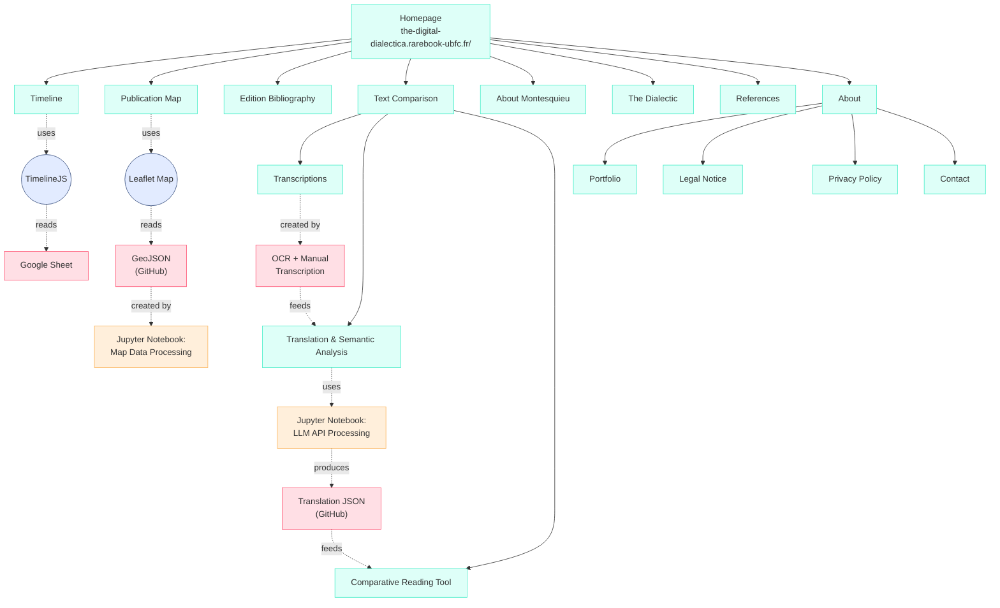

# The Digital Dialectica and Montesquieu's Book XIX

**Website:** https://the-digital-dialectica.rarebook-ubfc.fr/  
**Licence:** MIT

A critical Digital Humanities project examining Montesquieu's *De l'esprit des lois* Book XIX through computational methods that expose the incompatibility between contextual humanistic philosophy and digital infrastructure that is built for purposes other than humanistic understanding.

**Author:** lokalkosmos  
**Institution:** Université de Franche-Comté

---

## Table of Contents

- [Project Overview](#project-overview)
- [Research Philosophy](#research-philosophy)
- [Repository Structure](#repository-structure)
- [Corpus and Data](#corpus-and-data)
- [Methodological Approach](#methodological-approach)
- [Technologies Used](#technologies-used)
- [Architecture](#architecture)
- [What This Project Is (and Is Not)](#what-this-project-is-and-is-not)
- [Using This Repository](#using-this-repository)
- [Acknowledgements of Limitations](#acknowledgements-of-limitations)
- [Citation](#citation)
- [Licence](#licence)
- [Acknowledgements](#acknowledgements)
- [Contact](#contact)

---

## Project Overview

This repository supports a Master's thesis examining Montesquieu's *De l'esprit des lois* Book XIX, specifically Chapters I-VI where he articulates the concept of *esprit général* (general spirit). The project employs Digital Humanities methods as objects worthy of critical analysis themselves, investigating what happens when computational approaches and ideologies are applied to the humanistic learning of philosophical concepts that in principle contradicts the ideological framework and operations such methods require.

**The central argument:** When digital tools meet Montesquieu's philosophy of irreducible contextual complexity, the resulting friction generates insights about both eighteenth-century political thought and contemporary digital scholarship. The project examines how computational methods originally built for military command, control, and corporate optimisation deal with philosophical commitments to humanistic contextual particularity that challenge systematisation.

### Core Philosophical Position

Digital tools offer useful capabilities but remain fundamentally limited instruments requiring critical humanistic interpretation. This project treats computational limitations as philosophically significant findings within the ideology and rhetoric that supports an ever digitalising world. The tools examined here emerged from military and corporate infrastructure designed for extraction and standardisation. When these tools only prove to be inadequate for capturing Montesquieu's contextual epistemology, they show their suitability for their intended purposes other than nuanced humanistic scholarship.

---

## Research Philosophy

This project adopts a critically aware approach to Digital Humanities:

✓ Treats digital tools as objects of critical analysis alongside historical texts  
✓ Acknowledges that contemporary digital infrastructure emerged from specific origins that shape its operations  
✓ Recognises that abstraction shapes what becomes visible and what remains obscured  
✓ Validates computational outputs through sustained human interpretation grounded in disciplinary expertise  
✓ Embraces the friction when methods deal with texts that challenge their ideological assumptions  
✓ Documents methodological struggles as research findings  
✓ Examines how forced machine-mediation reduces the lived experience of contextual difference that Montesquieu's *esprit général* concept requires

The project rejects:

✗ Claims that computational methods are objective or neutral  
✗ Technological determinism or solutionism  
✗ Reducing humanistic enquiry to pattern recognition  
✗ Black box analysis without acknowledging opacity and its implications for the ideology supporting an ever digitalising world  
✗ Treating scale as inherently superior to interpretive depth  
✗ Digital methods as inevitable rather than ideologically shaped tools

Following scholars like Johanna Drucker, Alan Liu, Stephen Ramsay, and Paul Edwards, this project understands that all data visualisation is rhetorical, that tools encode political possibilities through their design, that infrastructure carries forward the logics of its origins, and that Digital Humanities requires cultural criticism of its own practices.

---

## Repository Contents

The repository contains transcription files, processing notebooks, datasets, and analytical outputs. All files are available at https://github.com/lokalkosmos/Lesprit

---

---

## Corpus and Data

### Primary Textual Corpus

**15 editions** of Book XIX (Chapters I-VI) transcribed and analysed:

- **Languages:** French (original), English, Italian, German, Polish
- **Date Range:** 1748 (Geneva first edition) to 1803
- **Method:** Transkribus OCR with extensive manual correction
- **Format:** Structured text files and JSON with hierarchical organisation

These editions enable examination of:
- Textual variation across printings
- Translation practices and semantic shifts
- How *esprit général* transforms across linguistic boundaries
- Editorial interventions in different publication contexts

### Extended Corpus

**~100 editions** mapped geographically:

- **Coverage:** 17 European cities across 11 regions
- **Period:** 1748-c. 1800
- **Source:** Penny University dataset and institutional archives
- **Purpose:** Demonstrating dissemination patterns whilst acknowledging that geographical coordinates cannot capture cultural complexity

### Timeline Data

**29 historical events** (1689-c. 1800):
- Montesquieu's biography and publication history
- American and French revolutionary applications
- Catholic Church censorship (Index, 1751)
- Constitutional developments influenced by *De l'esprit des lois*

---

## Methodological Approach

### Transcription Process

**Challenge:** Eighteenth-century typography confounds modern OCR systems.

- **Tool:** Transkribus for initial automated transcription
- **Problems Encountered:**
  - Long s (ſ) misrecognised as f, s, or unrecognised
  - Ligatures (æ, œ) unreliably processed
  - Archaic orthography and punctuation
  - Period-specific typographic conventions

- **Solution:** Extensive manual page-by-page correction comparing OCR output against original scans.

This labour-intensive process shows a fundamental problem. The promise of computational efficiency meets the reality that automation cannot achieve scholarly accuracy without sustained human intervention grounded in disciplinary expertise.

### Data Structuring as Epistemology

Datafying material, social and intellectual history and philosophy involves interpretive choices with philosophical implications:

- Everything is segmented into discrete computational units and forced into structures that affect the content and the user experience
- Material features (typography, layout, marginalia) that add context essentially become invisible in textual analysis

Data preparation and presentation itself enacts the abstraction Montesquieu's philosophy problematises. The requirement for standardisation and uniformity contradicts his insistence on contextual particularity.

### Large Language Model Analysis

- **Tool:** Claude 3.5 Sonnet (Anthropic)
- **Configuration:** Temperature 0.3, max tokens 2000, seed 42
- **Purpose:** Translation and semantic comparison across 15 editions

**Critical Acknowledgement:**

✓ LLM analysis operates as a black box fundamentally opaque to external examination  
✓ Outputs probably contain subtle inaccuracies, anachronisms, biases, and generalisations
✓ Statistical pattern recognition is optimised for engagement metrics and does not equal philosophical interpretation  
✓ Systems designed for surveillance capitalism's extraction purposes cannot accommodate humanistic nuance by design  
✓ All automated analyses require validation through traditional scholarly expertise

**Why use LLMs despite limitations?** Scale and consistency for exploratory analysis, with full transparency about boundaries. The opacity and inadequacy are documented as methodological evidence demonstrating epistemological limits and the ideological purposes these systems serve.

---

## Technologies Used

### Core Tools

- **Transkribus** - OCR for historical documents (READ-COOP consortium)
- **Claude 3.5 Sonnet** - Large language model (Anthropic)
- **Python 3.x** - Data processing and analysis
- **Jupyter Notebooks** - Reproducible analytical workflows

### Libraries and Frameworks

- **Pandas** - Data manipulation
- **JSON** - Structured data storage

### Visualisation and Web

- **WordPress** - Content management (Université de Franche-Comté hosting)
- **TimelineJS** - Interactive timeline (Knight Lab, Northwestern)
- **Leaflet** - Geographic mapping (open source)
- **TablePress** - Bibliographic tables
- **JavaScript** - Comparative reading interface

### Data Sources

**Digitised Copies:**
- Gallica (Bibliothèque nationale de France)
- Google Books
- Internet Archive
- Institutional repositories

**Publication Metadata:**
- Penny University Dataset
- Scholarly literature
- Gallica, Google Books, Internet Archive, and institutional repositories

---

## Architecture

### Website Structure



### Data Pipeline

1. **Source Materials** → Digitised eighteenth-century editions (Gallica, Google Books, institutional archives)
2. **OCR Processing** → Transkribus automated transcription
3. **Manual Correction** → Scholarly accuracy checking
4. **Structuring** → JSON and CSV formats with metadata
5. **Analysis** → LLM-assisted translation and semantic comparison
6. **Validation** → Human expert review of computational outputs
7. **Visualisation** → Interactive web interfaces
8. **GitHub Repository** → Version-controlled open data

---

## What This Project Is (and Is Not)

This project offers:

🔍 Critical examination of digital tools alongside historical texts  
📊 Transparency about methodological limits as philosophical findings  
🤝 Infrastructure for collaborative scholarship  
📚 Humanistic interpretation augmented by computation  
🔓 Open scholarship with reproducible methods  
⚖️ Epistemological examination of what algorithms built for surveillance capitalism can show about contextual humanistic knowledge  
🏛️ Analysis of how digital infrastructure's origins are incompatible with humanistic values

This project does not claim:

✗ That computational methods show objective truth  
✗ Techno-utopianism or digital solutionism  
✗ That distant reading replaces close reading  
✗ That big data is inherently superior  
✗ Uncritical acceptance of algorithmic outputs  
✗ That digitalisation is ideologically neutral or inevitable

**Key Insight:** When Montesquieu's philosophy of irreducible contextual complexity meets computational methods requiring abstraction and standardisation, the struggle itself becomes significant data. The limitations show epistemological boundaries and the ideological purposes digital infrastructure serves.

---

## Using This Repository

### For Researchers

Clone and examine the data:

```bash
git clone https://github.com/lokalkosmos/Lesprit.git
cd Lesprit
```

All transcriptions, analytical code, and documentation are available for:
- Verification of scholarly claims
- Extension to additional editions or chapters
- Comparative analysis with other Enlightenment texts
- Critical examination of DH methodologies
- Investigation of infrastructure politics in digital scholarship

### For DH Practitioners

This repository provides:
- Transparent methodology including acknowledged failures and limitations
- Reproducible workflows via Jupyter notebooks
- Critical commentary on tool limitations and infrastructure politics
- Model for reflexive DH practice that questions its own methods and origins

### For Philosophers and Historians

The data enables traditional humanistic enquiry:
- Close reading of textual variants
- Translation history analysis
- Montesquieu reception studies
- Enlightenment print culture research

The digital infrastructure serves interpretation.

---

## Acknowledgements of Limitations

In the spirit of methodological transparency, this project acknowledges:

**Note on Verification:** The findings presented require expert verification from specialists in historical linguistics, eighteenth-century philosophy, and textual studies. This verification has not yet been completed.

### Corpus Size

- 15 editions enable depth but limit statistical analysis
- **Trade-off:** Textual nuance vs. computational scale
- Small corpora permit attention to contextual particularity that Montesquieu's philosophy values

### Linguistic Expertise

- Researcher background in philosophy and book history, not historical linguistics
- Translation analysis relies on scholarly sources and validated automation
- Honest acknowledgement of expertise boundaries establishes more reliable foundations than false confidence

### Computational Opacity

- LLM operations remain black box despite configuration transparency
- Cannot verify reasoning behind specific outputs
- Algorithmic inscrutability contradicts scholarly values of reasoned argumentation and shows systems designed for their intended purposes other than transparent scholarship

### Data Structuring

- JSON formatting imposes uniformity historical texts challenge
- Material features (typography, marginalia) dissolve into metadata
- Data preparation enacts the abstraction Montesquieu critiques, showing how computational requirements shape what becomes knowable

### Interface Complexity

- Comparative reading tool creates information density that can overwhelm
- Multiple windows with lengthy passages may obscure more than clarify
- Computational presentation fragments philosophical arguments requiring sustained exposition, demonstrating limits of machine-mediated engagement

### Geographical Abstraction

- Map treats culturally distinct cities as equivalent spatial coordinates
- Visualisation enables pattern recognition whilst eliminating the contextual richness that Montesquieu insists determines meaning

### Infrastructure Origins

- Technological tools emerged from military and corporate research programmes
- Digital infrastructure designed for command, control, and extraction by design
- When digital tools prove to be inadequate for humanistic understanding, it is a sign that their suitability is for their intended purposes other than nuanced humanistic scholarship.

These are philosophically significant findings about computational epistemology and the ideological purposes digital infrastructure serves.

---

## Citation

### Repository

```bibtex
@software{digital_dialectica_2025,
  author = {lokalkosmos},
  title = {The Digital Dialectica and Montesquieu's Book XIX: 
           A Critical Digital Humanities Project},
  year = {2025},
  url = {https://github.com/lokalkosmos/Lesprit},
  institution = {Université de Franche-Comté}
}
```

### Thesis

```bibtex
@mastersthesis{2025_montesquieu,
  author = {lokalkosmos},
  title = {The Digital Dialectica and Montesquieu's Book XIX: 
           Critical Tensions in Digital Humanities Scholarship},
  school = {Université de Franche-Comté},
  year = {2025},
  type = {Master's thesis},
  url = {https://the-digital-dialectica.rarebook-ubfc.fr/}
}
```

### Project Website

For citations to specific components:

- **Timeline:** https://the-digital-dialectica.rarebook-ubfc.fr/timeline/
- **Map:** https://the-digital-dialectica.rarebook-ubfc.fr/publication-map/
- **Bibliography:** https://the-digital-dialectica.rarebook-ubfc.fr/bibliography/
- **Comparative Tool:** https://the-digital-dialectica.rarebook-ubfc.fr/texts-comparison/
- **The Dialectic:** https://the-digital-dialectica.rarebook-ubfc.fr/the-dialectic/

---

## Licence

This project is licensed under the MIT Licence. See the [LICENSE](LICENSE) file for details.

All textual transcriptions, data files, and analytical code are freely available for:

- Academic research and teaching
- Extension and modification
- Commercial use (with attribution)

**Rationale:** Open licensing resists the proprietary enclosure increasingly characteristic of academic publishing infrastructure and aligns with scholarly values of transparency and collaborative knowledge production.

---

## Acknowledgements

### Institutional Support

- **Université de Franche-Comté** - Hosting infrastructure and academic support

### Data Sources

- **Penny University Dataset** - Publication metadata
- **Gallica (Bibliothèque nationale de France)** - Digitised editions
- **Google Books** - Historical text access
- **Institutional Archives** - Eighteenth-century holdings

### Tools and Platforms

- **Transkribus (READ-COOP)** - OCR for historical documents
- **Anthropic Claude** - Large language model analysis
- **Knight Lab (Northwestern)** - TimelineJS
- **Leaflet Contributors** - Open-source mapping

### Theoretical Foundations

This project builds on critical DH and technology scholarship by:

- **Johanna Drucker** (graphical epistemology and rhetorical visualisation)
- **Alan Liu** (cultural criticism in DH)
- **Stephen Ramsay** (hermeneutics of algorithmic criticism)
- **Paul Edwards** (infrastructure politics and closed worlds)
- **Shoshana Zuboff** (surveillance capitalism critique)

And many others cited in the thesis bibliography.

---

## Contact

- **Project Website:** https://the-digital-dialectica.rarebook-ubfc.fr/contact
- **GitHub Repository:** https://github.com/lokalkosmos/Lesprit

---

## Final Note: On Epistemological Modesty

This project concludes where it began: digital tools are useful but fundamentally limited. They make certain patterns visible whilst necessarily obscuring contextual richness. They enable scale but risk sacrificing depth. They promise efficiency but require extensive human labour for scholarly accuracy.

The friction between Montesquieu's contextual humanistic philosophy and computational abstraction illuminates both:

- What eighteenth-century political thought shows about limits of systematisation
- What contemporary digital methods show about their own epistemological boundaries and ideological origins

When tools built for surveillance capitalism deal with texts insisting on irreducible contextual complexity, the forced machine-mediation required reduces the lived experience of contextual difference that humanistic understanding requires. This friction demonstrates tool success at their intended purposes other than nuanced humanistic scholarship.

Approached critically, reflexively, and with epistemological examination of infrastructure's ideological purposes, digital methods can serve humanistic enquiry into texts that challenge the very operations performed upon them. That friction is where insight begins.

---

**Last Updated:** October 2025  
**Project Status:** Active development / Thesis completion

For the most current version of the website and data, visit:  
**https://the-digital-dialectica.rarebook-ubfc.fr/**

---

## Research Philosophy

This project adopts a critically aware approach to Digital Humanities:

✓ Treats digital tools as objects of critical analysis alongside historical texts  
✓ Acknowledges that contemporary digital infrastructure emerged from military and corporate research programmes designed for command, control, and optimisation  
✓ Recognises that abstraction shapes what becomes visible and what remains obscured  
✓ Validates computational outputs through sustained human interpretation grounded in disciplinary expertise  
✓ Embraces productive friction when methods encounter texts that challenge their assumptions  
✓ Documents methodological struggles as research findings  
✓ Examines how forced machine-mediation reduces the lived experience of contextual difference that Montesquieu's *esprit général* concept requires

The project rejects:

✗ Claims that computational methods are objective or neutral  
✗ Technological determinism or solutionism  
✗ Reducing humanistic enquiry to pattern recognition  
✗ Black box analysis without acknowledging opacity and its implications  
✗ Treating scale as inherently superior to interpretive depth  
✗ Digital methods as ideology

Following scholars like Johanna Drucker, Alan Liu, Stephen Ramsay, and Paul Edwards, this project understands that all data visualisation is rhetorical, that tools encode political possibilities through their design, that infrastructure carries forward the logics of its origins, and that Digital Humanities requires cultural criticism of its own practices.

---

## Repository Contents

The repository contains transcription files, processing notebooks, datasets, and analytical outputs. All files are available at https://github.com/lokalkosmos/Lesprit

---

## Corpus and Data

### Primary Textual Corpus

**15 editions** of Book XIX (Chapters I-VI) transcribed and analysed:

- **Languages:** French (original), English, Italian, German, Polish
- **Date Range:** 1748 (Geneva first edition) to 1803
- **Method:** Transkribus OCR with extensive manual correction
- **Format:** Structured text files and JSON with hierarchical organisation

These editions enable examination of:
- Textual variation across printings
- Translation practices and semantic shifts
- How *esprit général* transforms across linguistic boundaries
- Editorial interventions in different publication contexts

### Extended Corpus

**~100 editions** mapped geographically:

- **Coverage:** 17 European cities across 11 regions
- **Period:** 1748-1800
- **Source:** Penny University dataset and institutional archives
- **Purpose:** Demonstrating dissemination patterns whilst acknowledging that geographical coordinates cannot capture cultural complexity

### Timeline Data

**29 historical events** (1689-1804):
- Montesquieu's biography and publication history
- American and French revolutionary applications
- Catholic Church censorship (Index, 1751)
- Constitutional developments influenced by *De l'esprit des lois*

---

## Methodological Approach

### Transcription Process

**Challenge:** Eighteenth-century typography confounds modern OCR systems.

- **Tool:** Transkribus for initial automated transcription
- **Problems Encountered:**
  - Long s (ſ) misrecognised as f, s, or unrecognised
  - Ligatures (æ, œ) unreliably processed
  - Archaic orthography and punctuation
  - Period-specific typographic conventions

- **Solution:** Extensive manual page-by-page correction comparing OCR output against original scans.

This labour-intensive process shows a fundamental problem. The promise of computational efficiency meets the reality that automation cannot achieve scholarly accuracy without sustained human intervention grounded in disciplinary expertise.

### Data Structuring as Epistemology

Converting historical texts to JSON and structured formats involves interpretive choices with philosophical implications:

- Texts segmented into discrete computational units
- Metadata following predetermined schemas
- Material features (typography, layout, marginalia) dissolving into character strings

Data preparation itself enacts the abstraction Montesquieu's philosophy problematises. The requirement for standardisation and uniformity contradicts his insistence on contextual particularity. This is constitutive of how infrastructure built for military and corporate purposes operates.

### Large Language Model Analysis

- **Tool:** Claude 3.5 Sonnet (Anthropic)
- **Configuration:** Temperature 0.3, max tokens 2000, seed 42
- **Purpose:** Translation and semantic comparison across 15 editions

**Critical Acknowledgement:**

✓ LLM analysis operates as black box neural network fundamentally opaque to external examination  
✓ Outputs may contain subtle inaccuracies, anachronisms, biases, and generalisations  
✓ Statistical pattern recognition optimised for engagement metrics does not equal philosophical interpretation  
✓ Systems designed for surveillance capitalism's extraction purposes cannot accommodate humanistic nuance  
✓ All automated analyses require validation through traditional scholarly expertise

**Why use LLMs despite limitations?** Scale and consistency for exploratory analysis, with full transparency about boundaries. The opacity and inadequacy are documented as methodological concerns demonstrating epistemological limits.

---

## Technologies Used

### Core Tools

- **Transkribus** - OCR for historical documents (READ-COOP consortium)
- **Claude 3.5 Sonnet** - Large language model (Anthropic)
- **Python 3.x** - Data processing and analysis
- **Jupyter Notebooks** - Reproducible analytical workflows

### Libraries and Frameworks

- **Pandas** - Data manipulation
- **JSON** - Structured data storage

### Visualisation and Web

- **WordPress** - Content management (Université de Franche-Comté hosting)
- **TimelineJS** - Interactive timeline (Knight Lab, Northwestern)
- **Leaflet** - Geographic mapping (open source)
- **TablePress** - Bibliographic tables
- **JavaScript** - Comparative reading interface

### Data Sources

**Digitised Copies:**
- Gallica (Bibliothèque nationale de France)
- Google Books
- Internet Archive
- Institutional repositories

**Publication Metadata:**
- Penny University Dataset
- Scholarly articles
- Gallica, Google Books, Internet Archive, and institutional repositories

---

## Architecture

### Website Structure


### Data Pipeline

1. **Source Materials** → Digitised eighteenth-century editions (Gallica, Google Books, institutional archives)
2. **OCR Processing** → Transkribus automated transcription
3. **Manual Correction** → Scholarly accuracy checking
4. **Structuring** → JSON and CSV formats with metadata
5. **Analysis** → LLM-assisted translation and semantic comparison
6. **Validation** → Human expert review of computational outputs
7. **Visualisation** → Interactive web interfaces
8. **GitHub Repository** → Version-controlled open data

---

## What This Project Is (and Is Not)

This project offers:

🔍 Critical examination of digital tools alongside historical texts  
📊 Transparency about methodological limits as philosophical findings  
🤝 Infrastructure for collaborative scholarship  
📚 Humanistic interpretation augmented by computation  
🔓 Open scholarship with reproducible methods  
⚖️ Epistemological modesty about what algorithms built for surveillance capitalism can show about contextual knowledge  
🏛️ Analysis of how digital infrastructure emerged from military and corporate origins incompatible with humanistic values

This project does not claim:

✗ That computational methods show objective truth  
✗ Techno-utopianism or digital solutionism  
✗ That distant reading replaces close reading  
✗ That big data is inherently superior  
✗ Uncritical acceptance of algorithmic outputs

**Key Insight:** When Montesquieu's philosophy of irreducible contextual complexity meets computational methods requiring abstraction and standardisation, the struggle itself becomes significant data. The limitations show epistemological boundaries and the politics of digital infrastructure.

---

## Using This Repository

### For Researchers

Clone and examine the data:

```bash
git clone https://github.com/lokalkosmos/Lesprit.git
cd Lesprit
```

All transcriptions, analytical code, and documentation are available for:
- Verification of scholarly claims
- Extension to additional editions or chapters
- Comparative analysis with other Enlightenment texts
- Critical examination of DH methodologies
- Investigation of infrastructure politics in digital scholarship

### For DH Practitioners

This repository provides:
- Transparent methodology including acknowledged failures and limitations
- Reproducible workflows via Jupyter notebooks
- Critical commentary on tool limitations and infrastructure politics
- Model for reflexive DH practice that questions its own methods and origins

### For Philosophers and Historians

The data enables traditional humanistic enquiry:
- Close reading of textual variants
- Translation history analysis
- Montesquieu reception studies
- Enlightenment print culture research

The digital infrastructure serves interpretation.

---

## Acknowledgements of Limitations

In the spirit of methodological transparency, this project acknowledges:

**Note on Verification:** The findings presented require expert verification from specialists in historical linguistics, eighteenth-century philosophy, and textual studies. This verification has not yet been completed.

### Corpus Size

- 15 editions enable depth but limit statistical analysis
- **Trade-off:** Textual nuance vs. computational scale
- Small corpora permit attention to contextual particularity that Montesquieu's philosophy values

### Linguistic Expertise

- Researcher background in philosophy and book history, not historical linguistics
- Translation analysis relies on scholarly sources and validated automation
- Honest acknowledgement of expertise boundaries establishes more reliable foundations than false confidence

### Computational Opacity

- LLM operations remain black box despite configuration transparency
- Cannot verify reasoning behind specific outputs
- Algorithmic inscrutability contradicts scholarly values of reasoned argumentation and shows systems designed for purposes other than transparent scholarship

### Data Structuring

- JSON formatting imposes uniformity historical texts challenge
- Material features (typography, marginalia) dissolve into metadata
- Data preparation enacts the abstraction Montesquieu critiques, showing how computational requirements shape what becomes knowable

### Interface Complexity

- Comparative reading tool creates information density that can overwhelm
- Multiple windows with lengthy passages may obscure more than clarify
- Computational presentation fragments philosophical arguments requiring sustained exposition, demonstrating limits of machine-mediated engagement

### Geographical Abstraction

- Map treats culturally distinct cities as equivalent spatial coordinates
- Geneva ≠ London ≠ Naples in ways location cannot capture
- Visualisation enables pattern recognition whilst eliminating contextual richness that Montesquieu insists determines meaning

### Infrastructure Origins

- Tools examined emerged from military and corporate research programmes
- Digital infrastructure designed for command, control, and extraction
- When tools prove inadequate for humanistic understanding, the inadequacy demonstrates their suitability for surveillance capitalism's purposes

These are philosophically significant findings about computational epistemology and the politics of digital infrastructure.

---

## Citation

### Repository

```bibtex
@software{digital_dialectica_2025,
  author = {lokalkosmos},
  title = {The Digital Dialectica and Montesquieu's Book XIX: 
           A Critical Digital Humanities Project},
  year = {2025},
  url = {https://github.com/lokalkosmos/Lesprit},
  institution = {Université de Franche-Comté}
}
```

### Thesis

```bibtex
@mastersthesis{2025_montesquieu,
  author = {lokalkosmos},
  title = {The Digital Dialectica and Montesquieu's Book XIX: 
           Critical Tensions in Digital Humanities Scholarship},
  school = {Université de Franche-Comté},
  year = {2025},
  type = {Master's thesis},
  url = {https://the-digital-dialectica.rarebook-ubfc.fr/}
}
```

### Project Website

For citations to specific components:

- **Timeline:** https://the-digital-dialectica.rarebook-ubfc.fr/timeline/
- **Map:** https://the-digital-dialectica.rarebook-ubfc.fr/publication-map/
- **Bibliography:** https://the-digital-dialectica.rarebook-ubfc.fr/bibliography/
- **Comparative Tool:** https://the-digital-dialectica.rarebook-ubfc.fr/texts-comparison/
- **The Dialectic:** https://the-digital-dialectica.rarebook-ubfc.fr/the-dialectic/

---

## Licence

This project is licensed under the MIT Licence. See the [LICENSE](LICENSE) file for details.

All textual transcriptions, data files, and analytical code are freely available for:

- Academic research and teaching
- Extension and modification
- Commercial use (with attribution)

**Rationale:** Open licensing resists the proprietary enclosure increasingly characteristic of academic publishing infrastructure and aligns with scholarly values of transparency and collaborative knowledge production.

---

## Acknowledgements

### Institutional Support

- **Université de Franche-Comté** - Hosting infrastructure and academic support

### Data Sources

**Digitised Copies:**
- Gallica (Bibliothèque nationale de France)
- Google Books
- Internet Archive
- Institutional repositories

**Publication Metadata:**
- Penny University Dataset
- Scholarly literature
- Gallica, Google Books, Internet Archive, and institutional repositories

### Tools and Platforms

- **Transkribus (READ-COOP)** - OCR for historical documents
- **Anthropic Claude** - Large language model analysis
- **Knight Lab (Northwestern)** - TimelineJS
- **Leaflet Contributors** - Open-source mapping

### Theoretical Foundations

This project builds on critical DH and technology scholarship by:

- **Johanna Drucker** (graphical epistemology and rhetorical visualisation)
- **Alan Liu** (cultural criticism in DH)
- **Stephen Ramsay** (hermeneutics of algorithmic criticism)
- **Paul Edwards** (infrastructure politics and closed worlds)
- **Shoshana Zuboff** (surveillance capitalism critique)

And many others cited in the thesis bibliography.

---

## Contact

- **Project Website:** https://the-digital-dialectica.rarebook-ubfc.fr/contact
- **GitHub Repository:** https://github.com/lokalkosmos/Lesprit

---

## Final Note: On Epistemological Modesty

This project concludes where it began: digital tools are useful but fundamentally limited. They make certain patterns visible whilst necessarily obscuring contextual richness. They enable scale but risk sacrificing depth. They promise efficiency but require extensive human labour for scholarly accuracy. They emerged from military and corporate infrastructure designed for command, control, and extraction.

The friction between Montesquieu's contextual philosophy and computational abstraction illuminates both:

- What eighteenth-century political thought shows about limits of systematisation
- What contemporary digital methods show about their own epistemological boundaries and political origins

When tools built for surveillance capitalism deal with texts insisting on irreducible contextual complexity, the forced machine-mediation required reduces the lived experience of contextual difference that humanistic understanding requires. This friction demonstrates tool success at purposes other than nuanced scholarship.

Approached critically, reflexively, and with epistemological modesty about infrastructure politics, digital methods can serve humanistic enquiry into texts that challenge the very operations performed upon them. That friction is where insight begins.

---

**Last Updated:** October 2025  
**Project Status:** Active development / Thesis completion

For the most current version of the website and data, visit:  
**https://the-digital-dialectica.rarebook-ubfc.fr/**
